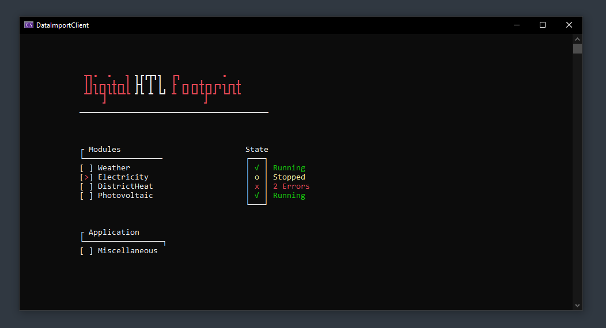
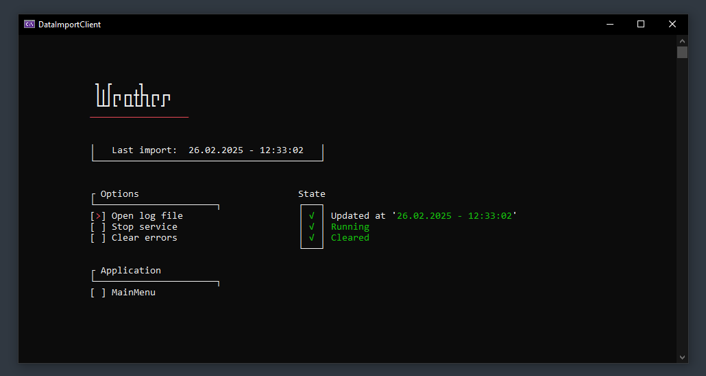
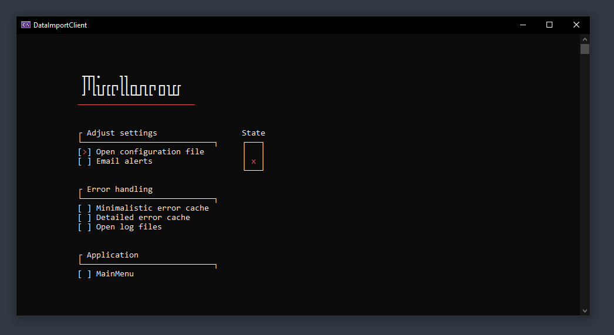
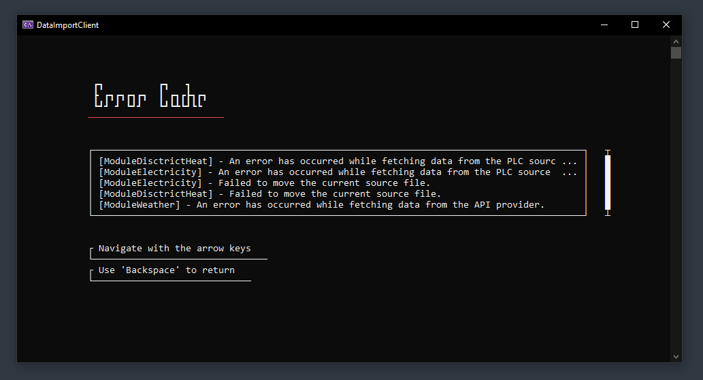

 

<h1 align="center">
  DataImportClient
</h1>

 

---

 

`DataImportClient` is a console based application, which allows to import data from various sources into a SQL database.

Sources are:
 - Different PLC's
 - API endpoints
 - CSV files which are received over FTP

This repository is part of the diploma thesis for the organization [DigitalHtlFootprint](https://github.com/DigitalHtlFootprint).

 

---

 

## External services used
- For drawing most of the menu [Wikipedia](https://wikipedia.org/) did a great job, on serving as a documentation on [box-drawing characters](https://en.wikipedia.org/wiki/Box-drawing_characters).
- Headers within the application were created using the website [patorjk.com](https://patorjk.com/software/taag/). This website allows to create big text in many different styles and fonts.
 
 

## Credits
Thanks to [Arewzom](https://github.com/Arwezom) and [thomas5476](https://github.com/thomas5476)
- For providing crucial feedback and ideas which lead the project one step closer to perfection.

 

---

 

<h1 align="center">
  Screenshots
</h1>

    
     
     
    
     
     
    
     
     
    

 

---
